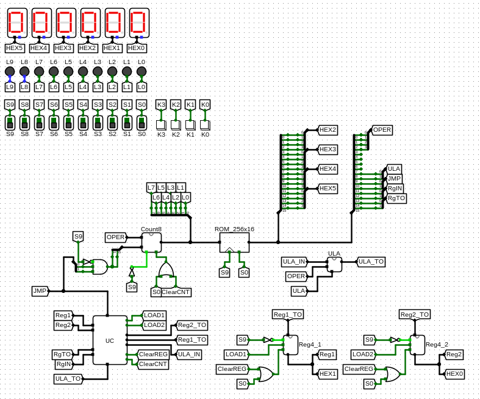

# Micro CPU

Micro CPU project did during Digital Systems discipline on Logisim, consisting in a very simple architecture to do arithmetic operations as it's loaded by a memory file. Some of the memory files tested can be found at this repository's files.

This project was made in a 3-people group, which it's autors were
* Natan Sanches;
* Marcos Almeida Patrício Nogueira;
* João Guilherme Jarochinski Marinho.

## Circuit Overview

Doing this project was fundamental to learn some basics concepts about computer architecture, such as flip-flops, registers, counters and how a ROM memory works. 

The arithmetic logic unit was built to operate with 4 bits size numbers, where the circuit's entire logic is based from a sequence of 16 bits inside it's memory file. It's interesting that the counter (which controls the memory addresses accesses sequentially) was made with an extension to jump to a specific memory address when a particular command is given.

We can also point it's usage:
* S0 dip switch controls the circuit's clock;
* S9 dip switch controls the circuit's Master Clear command;
* HEX5-HEX2 displays show which memory address is being acessed at that time;
* HEX1 display shows what's inside of the first register;
* HEX0 display shows what's inside of the second register;
* L7-L0 LEDs show the current count by the counter.
